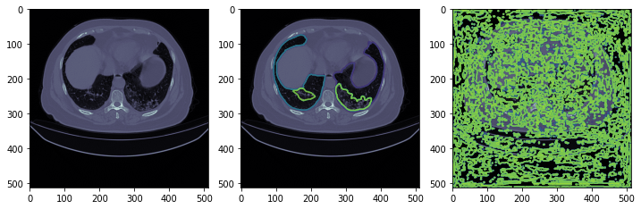

# CT covid segmentation
Segmentation of CT scans with use of Pytorch Lightning and segmentation models pytorch.

# Install
Install this directory with `pip install -e .`.

# Prepare Data
Create folder `input` in this directory.
Download https://www.kaggle.com/datasets/andrewmvd/covid19-ct-scans or similar dataset and unzip it into `input`.

Run `python ./scripts/prepare_pngs.py` to preprocess dataset into 256*256 images.

# Train
Run `python ./scripts/train.py` to start training with basic configuration. There are placeholder, that reduces size of dataset to 100 pngs and training goes for 1 epoch.

Result of training can be viewed in `./notebooks/visualization.ipynb`

# Example

# Uninstalling
Uninstall this directory by `pip uninstall ct_covid_segmentation` as you done with it
